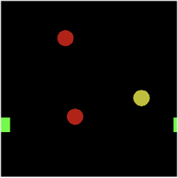
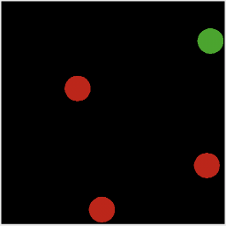
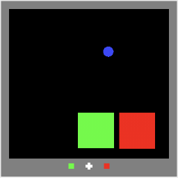

# MOOG Demos

This directory contains example tasks and scripts to run them. The entry point
is [`run_demo.py`](run_demo.py), which is a python script that launches a demo
gui to play a task, given a `--config` flag pointing to a configuration file.
See example tasks below for commands to run different example configs.

The `run_demo.py` file also has a `--write_gif` flag. Set that flag to `True` to
record your demo play as a gif to the file specified by the `--gif_file` flag.

The `run_demo.py` file also has a `--log_data` flag. Set that flag to `True` to
record your demo play as JSON-serialized strings for trials. From those logs you
can recover the demo play. See
[`restore_logged_data.py`](restore_logged_data.py) for an example of restoring
from logs and replaying a video of the demo play.

## Example Tasks

Some example task configs are in [example_configs](example_configs). Below are a
few gifs showing what playing these tasks is like. The gifs show the image
window of the demo display (the reward plot and controller display are cropped
out). Positive/negative rewards are indicated by green/red borders on the image,
purely for visualization purposes (this is done by the demo script, not the task
itself).

Note: Sometimes the gifs on this page are slow to load. If you don't want to
wait, you can right-click and open them in a new browser tab.

### [bounce_box_contact_prediction](example_configs/bounce_box_contact_prediction.py) <br>

In this task two red balls fall into a box. They bounce elastically off the
walls of the box, ultimately disappearing off the top of the screen because
there is no gravity. The subject's goal is to predict whether they will contact
each other. There is an occluder covering the bottom portion of the box. The
occluder may be translucent.

To play with a translucent occluder, run
```bash
$ python3 -m moog_demos.run_demo --config='moog_demos.example_configs.bounce_box_contact_prediction' --level=1
```
which will look like this:


To play with an opaque occluder, run
```bash
$ python3 -m moog_demos.run_demo --config='moog_demos.example_configs.bounce_box_contact_prediction' --level=0
```
which will look like this:


### [chase_avoid_torus](example_configs/chase_avoid_torus.py) <br>

In this task there are predators (red circles), prey (yellow circles) and an
agent (green square). The subject controls the agent with a joystick. The
subject's goal is to catch the prey while avoiding being caught by the
predators. The prey are repulsed by the agent and predators are attracted to the
agent. Prey and predators move stochasticity and with constant speed.

The environment geometry is shaped like a torus --- when an object reaches one
boundary, it reappears on the opposite boundary.

To play, run
```bash
$ python3 -m moog_demos.run_demo --config='moog_demos.example_configs.chase_avoid_torus' --level=0
```
which will look like this:



### [cleanup](example_configs/cleanup.py) <br>

This is a multi-agent task. In this task there are blue fountains at the top of
the arena and green fruit at the bottom of the arena. Each fountain can be
poisoned (dull color) or clean (bright color) and each fruit can be spoiled
(dull color) or ripe (bright color). If an agent contacts a poisoned fountain,
that fountain turns clean and a spoiled fruit turns ripe. If an agent contacts a
ripe fruit, the agent receives a reward but that fruit turns spoiled and a
fountain becomes poisoned.

So the agents have to go up to the fountains, clean them up to turn the fruit
ripe, then go down to the fruit and collect them (receiving reward), then when
there's no ripe fruit left they have to go back up to the fountains.

Some agents can be selfish free-riders by hanging out near the fruit and eating
them while others to clean the fountains. Other agents can be selfless by
cleaning fountains all the time and never eating fruit.

To play, run
```bash
$ python3 -m moog_demos.run_demo --config='multi_agent_example.configs.cleanup' --level=0
```
which will look like this:


### [colliding_predators](example_configs/colliding_predators.py) <br>

This task serves to showcase collisions. The predators have a variety of
polygonal shapes and bounce off each other and off the walls with Newtonian
collisions. The subject controls a green agent circle. The subject gets negative
reward if contacted by a predators and positive reward periodically.

To play, run
```bash
$ python3 -m moog_demos.run_demo --config='moog_demos.example_configs.colliding_predators' --level=0
```
which will look like this:


### [first_person_predators_prey](example_configs/first_person_predators_prey.py) <br>

In an inifite plane, predators and prey drift around and the agent is rewarded
for catching prey and punished for being caught by predators. The field of view
travels with the agent, keeping the agent centered at all times (first-person),
and there is an occluding annulus around the agent.

The subject receives positive reward proportional to a prey's size when a prey
is caught, and negative reward proportional to the predator's size when the
agent is caught by a predator.

To play, run
```bash
$ python3 -m moog_demos.run_demo --config='moog_demos.example_configs.first_person_predators_prey' --level=0
```
which will look like this:


### [functional_maze](example_configs/functional_maze.py) <br>

The predators (red circles) chase the agent. The agent receives reward for
catching prey (yellow circles), which disappear upon capture. The boosters (blue
triangles) temporarily increase the agent's speed. The portals (white squares)
teleport the agent from one place to another.

To play, run
```bash
$ python3 -m moog_demos.run_demo --config='moog_demos.example_configs.functional_maze' --level=0
```
which will look like this:


### [match_to_sample](example_configs/match_to_sample.py) <br>

In this task there are some colored circles (targets) on a ring, and an agent
avatar in the center of the ring. After an initial stimulus period where the
colored targets are visible, they all turn grey and begin rotating together.
After some time they stop and a colored cue appears on the agent avatar. The
subject must identify the target that had the same color as the cue and respond
by navigating towards that target.

This task requires workimg memory of multiple objects with features (colors).

To play, run
```bash
$ python3 -m moog_demos.run_demo --config='moog_demos.example_configs.match_to_sample' --level=3
```
which will look like this:


The `--level` flag controls the number of objects in the task.

### [multi_tracking_with_feature](example_configs/multi_tracking_with_feature.py) <br>

In this task, the subject controls the position of a small cross. Typically,
this would be controlled by an eye-tracker to follow the subject's gaze. There
are a number of circles with oriented bars (each initially randomly vertical or
horizontal). Those circles with bars drift around an arena, bouncing off the
walls. At a random time, one of the bars rotates 90 degrees. The subject's goal
is to identify and fixate on that target.

After a brief initial period in which they are all visible, an occluder appears
occluding peripheral vision. This forces the subject to mentally keep track of
the targets' locations and orientations.

To play, run
```bash
$ python3 -m moog_demos.run_demo --config='moog_demos.example_configs.multi_tracking_with_feature' --level=3
```
which will look like this:


The `--level` flag controls the number of objects in the task.

### [pacman](example_configs/pacman.py) <br>

In this task all objects move in a maze with the same speed. The maze is
randomized every trial. The subject controls a green agent. Red ghost agents
wander the maze randomly without backtracking. The subject's goal is to collect
all yellow pellets in the maze. Ghosts only begin moving once agent moves.

To play, run
```bash
$ python3 -m moog_demos.run_demo --config='moog_demos.example_configs.pacman' --level=0
```
which will look like this:


### [parallelogram_catch](example_configs/parallelogram_catch.py) <br>

In this task the subject controls a green circlular agent with a joystick. The
motion is first-person, so the agent is fixed at the center of the screen while
everything else moves. There are four yellow prey sprites. These prey sprites
are identical parallelograms, and they are spatially arranged in a parallelogram
with the same aspect ratio. There is an annulus occluding all peripheral vision,
i.e. never are two prey visible simultaneously.

The entire prey configuration may be drifting and rotating, depending on the
level.

This forces the subject to make a hierarchical inference task. After seeing the
first prey, there are four possible arrangements of the other prey. After
finding the second prey, there are two possible arrangements of the remaining
prey. After finding the third prey, the fourth prey's position is deterministic.

To play with static parallelograms, run
```bash
$ python3 -m moog_demos.run_demo --config='moog_demos.example_configs.parallelogram_catch' --level=0
```
which will look like this:


Different levels have different velocities of the parallelgram shapes' coherent
motion. For example, to play with moving parallelograms, run
```bash
$ python3 -m moog_demos.run_demo --config='moog_demos.example_configs.parallelogram_catch' --level=2
```
which will look like this:


### [pong](example_configs/pong.py) <br>

In this task the subject controls a paddle at the bottom of the screen with a
joystick. The paddle is constrained to only move left-right. Each trial one ball
falls from the top of the screen, starting at a random position and moving with
a random angle. The ball bounces off of vertical walls on either side of the
screen as it falls. The subject's goal is the intercept the ball with the
paddle.

To play, run
```bash
$ python3 -m moog_demos.run_demo --config='moog_demos.example_configs.pong' --level=0
```
which will look like this:


### [predators_arena](example_configs/predators_arena.py) <br>

The predators (red circles) chase the agent. The predators bouce off the arena
boundaries, while the agent cannot exit but does not bounce (i.e. it has
inelastic collisions with the boundaries). Trials only terminate when the agent
is caught by a predator. The subject controls the agent with a joystick.

This task also contains an auto-curriculum: When the subject does well (evades
the predators for a long time before being caught), the predators' masses are
decreased, thereby increasing the predators' speeds. Conversely, when the
subject does poorly (gets caught quickly), the predators' masses are increased,
thereby decreasing the predators' speeds.

To play, run
```bash
$ python3 -m moog_demos.run_demo --config='moog_demos.example_configs.predators_arena' --level=3
```
which will look like this:



The `--level` flag controls how many predators there are.

### [red_green](example_configs/red_green.py) <br>

In this task, there is a blue ball that bounces in an enclosed rectangular
arena. The arena may have gray rectangular obstacles that the blue ball bounces
off. The arena has one green box and one red box. The subject's goal is to
predict which of the green/red boxes the blue ball will contact first.

In this particular implementation, the subject moves a token at the bottom of
the screen left or right to indicate its choice.

To play without obstacles, run
```bash
$ python3 -m moog_demos.run_demo --config='moog_demos.example_configs.red_green' --level=0
```
which will look like this:



The `--level` flag controls how many predators there are. For example, to play
with 2 obstacles, run
```bash
$ python3 -m moog_demos.run_demo --config='moog_demos.example_configs.red_green' --level=2
```
which will look like this:


### Unstable Physics with [falling_balls](example_configs/falling_balls.py) <br>

This task is not really a task, but instead used to demonstrate errors in
collision physics.

In this task some circles fall from the top of the screen, acted on by gravity.
The collide with each other, settling onto a wall at the bottom of the screen.
There is a divider in the bottom wall to add more collisions. The balls collide
with some elasticity with the walls and each other.

The collision dynamics for this task often do not look realistic. This is
because the collision force can be unrealistic under two conditions (both of
which are present in this task): * When an object collides while also
accelerating due to some force at a distance. * When an object undergoes
multiple collisions simultaneously.

The issues arise most often with sprites that have many vertices, such as the
circles in this task.

Consider this task a word of caution when using collisions with many moving
objects and non-collision forces.

To play, run
```bash
$ python3 -m moog_demos.run_demo --config='moog_demos.example_configs.falling_balls' --level=0
```
which will look like this:


